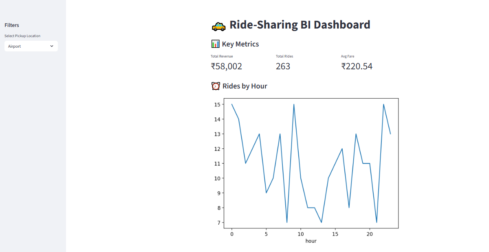
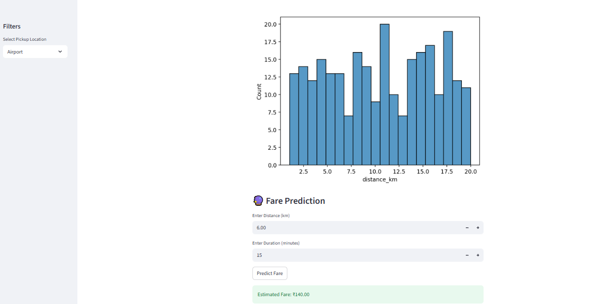

## 🚀 Live Demo
👉 https://ride-sharing-business-intelligence-system-hyh8xexksquyo8ly9cpn.streamlit.app/

# Ride-Sharing-Business-Intelligence-System
Ride-Sharing BI Dashboard with ML Prediction

Ride-sharing companies need to:

Understand demand patterns
Optimize pricing strategies
Improve operational efficiency

This project simulates how data can be used to support data-driven decision-making.

⚙️ Features
📊 Data Analysis
Ride demand trends by hour and location
Revenue distribution across locations
Trip distance and duration insights

📈 Dashboard (Streamlit)
Interactive filters
Key metrics (Revenue, Rides, Avg Fare)
Visualizations for business insights

🔮 Machine Learning
Linear Regression model
Predicts fare based on:
Distance (km)
Trip duration (minutes)

📊 Dashboard Preview

🛠️ Tech Stack
Python
Pandas, NumPy (Data Processing)
Matplotlib, Seaborn (Visualization)
Scikit-learn (Machine Learning)
Streamlit (Dashboard)

📁 Project Structure

ride-sharing-bi/
│── app.py                  # Streamlit dashboard
│── ride_sharing_data.csv   # Dataset
│── notebook.ipynb          # Data analysis
│── requirements.txt        # Dependencies
│── README.md               # Project documentation

▶️ How to Run Locally
# Clone the repository
git clone https://github.com/your-username/ride-sharing-bi.git

# Navigate to project folder
cd ride-sharing-bi

# Install dependencies
pip install -r requirements.txt

# Run the app
streamlit run app.py
📈 Key Insights
Peak ride demand occurs during specific hours
Certain locations contribute significantly to revenue
Trip distance has a strong impact on fare

🚀 Future Improvements
Add geospatial visualization (maps)
Implement demand forecasting
Deploy the dashboard online
Use real-world datasets

👨‍💻 Author
Santosh

⭐ If you found this useful, give it a star!

